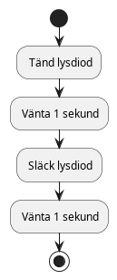

# Arduino programmering
Nu ska vi kicka av programmeringen av Arduino kortet men innan vi går till att programmera roboten måste vi lära oss lite om hur man programmerar enklare saker än en robot.
Som standard börjar man blinka med lys dioden på kortet.



I illustrationen av programmet ovan ser du att en lysdiod tänd, vänta, släck och slutligen vänta igen.
Sedan startas programmet om från början igen med tänd, vänta, släck och vänta.

Fråga varför behöver vi den sista vänta?
Svar: Efter som när programmet går runt och börjar om från början så kommer tiden lampan är släkt att vara noll.
Detta med för att lysdioden aldrig kommer vara avstängd.


Så hur skriver vi det i Arduino miljön?
Först frågar vi os vad som är meningen med programmet.
Vart jag svarar att blinka en lampa på och av en gång i sekunden.
Så här löste jag det.
(Jag förklarar hur programmet fungerar under kod stycket).

``` c
void setup(){
    pinMode(LED_BUILTIN, OUTPUT);
}
void loop(){
    digitalWrite(LED_BUILTIN, HIGH);
    delay(1000);
    digitalWrite(LED_BUILTIN, LOW);
    delay(1000);
}
```

Vi kan börja med att observera att det är två funktioner i programmet.
Det vi börjar med är det som står i `loop()` funktionen så tar vi `setup()` funktionen senare.

1. `digitalWrite()` är ett funktions anrop som vill ha två parametrar.
    1. `LED_BUILTIN` talar om för programmet att den inbyggda lysdioden ska användas.
    2. `HIGH` eller `LOW` talar om lysdioden att den ska vara på eller av.

Det vill säga att den första `digitalWrite(LED_BUILTIN, HIGH)` talar om för systemet att lampan ska tändas.

3. `delay()` med endast ett nummer för fördröjning i millisekunder.
Så exempelvis `delay(1000)` är lika med en fördröjning på en sekund.


