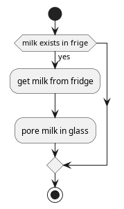
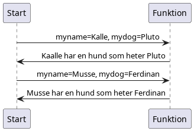

# 1. Introduktion till programmering.
Vi börjar med att diskutera programmering som genom att använda procedurmässiga språk.
Det betyder att vi försöker beskriva vad vi vill göra i klar språk utan komplexiteten av riktig programmera.
Efter som "alla" programmering språk är skrivna på engelska så skriver vi det på engelska men genom att använda kommentarer bakom `//` så översätter jag det till svenska.

Som första exempel så antar vi att en robot ska hämta mjölken ur kylskåpet och hälla upp ett glas mjölk.

```
get milk from fridge. // Ta mjölken från kylskåpet.
pore milk in glas.    // Häll mjölken i glaset.
```

Det ser ut som att det skulle fungera men vad händer om det inte finns någon mjölk.
Ska vi då fortsätta med att hälla upp mjölken trots att den inte existerar?

```
if milk exists in frige{  // Om mjölken existerar i kylskåpet.
    get milk from fridge. // Ta mjölken från kylskåpet.
    pore milk in glas.    // Häll mjölken i glasset.
}
```
Den nya raden som börjar med `if` är ett så kallad villkor.
Villkoret ser i det här fallet till att det finns en mjölk i kylskåpet och endast om det finns det tar vi fram mjölken i kylskåpet, serverar mjölken i ett glas.
Finns det ingen mjölk gör vi inget.



Nu är det så att datorer och robotar är väldigt dumma och kan bara göra det du säger åt dem att göra.
Så vi kan inte plocka ut mjölken ur kylskåpet utan att gå till kylskåpet och öppna dörren.

```
walk to fridge;             // Gå til kylskåpet.
open fridge dor;            // Öppna kylskåpet.
if milk exists in frige{    // Om mjölken existerar I kylskåpet
    get milk from fridge.   // Ta mjölken från kylskåpet.
    pore milk in glas.      // Häll mjölken i glasset.
}
```

Nu ser du att roboten ska gå till kylskåpet och hämta mjölken, men när kom glaset fram i bilden?
Så du måste se till att roboten hämtar glaset först.

```
walk to cabinet;            // Gå till skåpet med glas.
get glas;                   // Plocka fram glaset från skåpet.
place glas on table;        // Ställ glaset på bordet.
walk to fridge;             // Gå til kylskåpet.
open fridge dor;            // Öppna kylskåpet.
if milk exists in frige{    // Om mjölken existerar I kylskåpet
    get milk from fridge.   // Ta mjölken från kylskåpet.
    go to table;            // Gå till bordet.
    pore milk in glas.      // Häll mjölken i glasset.
}
```

Men om kabinettet inte har ett glas måste du avbryta ditt program så att roboten inte går och häller mjölk i ett glas som inte existerar.

```
walk to cabinet;            // Gå till skåpet med glas.
if glas not exists in cabinet{ // Om det INTE existerar ett glas i skåpet.
    stop;                   // Avbryt, gör inget.
}
get glas;                   // Plocka fram glaset från skåpet.
place glas on table;        // Ställ glaset på bordet.
walk to fridge;             // Gå til kylskåpet.
open fridge dor;            // Öppna kylskåpet.
if milk exists in frige{    // Om mjölken existerar I kylskåpet
    get milk from fridge.   // Ta mjölken från kylskåpet.
    go to table;            // Gå till bordet.
    pore milk in glas.      // Häll mjölken i glasset.
}
```

Observera att den första så kallade `if` satsen har ett så kallat stopp sats som för hindrar att program körs med felaktiga data genom att helt enkelt sluta att köra det programmet.

Nu har vi fortfarande problem med satsen `pore milk in glas` som här för generellt.
Vi ska nu introducera loop satsen som ber roboten att göra samma sak flera gånger.


```
walk to cabinet;
if glas not exists in cabinet{
    stop;
}
get glas;
place glas on table;
walk to fridge;
open fridge dor;
if milk exists in frige{
    get milk;
    go to table;
    while glas not full {
        fill glass with milk;
    }
}
```

Nu ser att mjölken fylls på till att glaset är fullt.
Men vårat program börjar bli långt så vi måste bryta upp programmet i mindre program.
Det gör vi genom att använda funktioner.
Funktioner definieras så här:

```
output type fuction_name(input variables){
    // Vilken cod som helst.
    return output;  //
}
```

I från skolan kanske ni har provat funktioner i matten?
Exempelvis funktionen:

$$y = a*x + b$$

Och när ni ska räkna eller göra det till en graf så kanske ni får sätta upp en tabell.
Exempelvis låt $a=5$ och $b=-2$ då får vi funktionen:

$$ y = 5*x - 2 $$

Sätter vi upp en tabell för alla värden mellan $-2$ och $5$ så kan en tabell se ut ungefär så här:

| x   | -2  | -1  | 0   | 1   | 2   | 3   | 4   | 5   |
| --- | --- | --- | --- | --- | --- | --- | --- | --- |
| y   | -12 | -7  | -2  | 3   | 8   | 13  | 18  | 23  |


För att samma funktion som ovan i med programmering skriver vi
Så här i programmerings språket C som används på Arduino.

``` c
int y(int x){           // Returnera ett heltal från funktionen y som tar x som argument
    int resultat = 5*x - 2;    // spara resultatet av matten i en variabel.
    return resultat; // skicka tillbaka resultatet.
}
```


Så i vårat fall kanske vi vill bryta ut fyllningen av glaset till en separat funktion.

```
none fill_glas(liquid, glas){
    while glas not full {
        fill glas with liquid;
    }
}

walk to cabinet;
if glas not exists in cabinet{
    stop;
}
get glas;
place glas on table;
walk to fridge;
open fridge dor;
if milk exists in frige{
    get milk;
    go to table;
    fill_glas(milk, glas);
}
```

Observera att nu har vi ett funktions anrop till fyllning av en flytande substans.
Nu kan vi även anropa funktionen att fylla glaset med saft i stället för mjölk.

```
fill_glass(saft, glas);
```

Och på så sätt har vi fått en modulärt användbar kod.
Nu är det så att de flesta språk anser att all kod måste ligga i sina egna funktioner.

```
none fill_glas(liquid, glas){
    while glas not full {
        fill glas with liquid;
    }
}

int main(void){
    walk to cabinet;
    if glas not exists in cabinet{
        stop;
    }
    get glas;
    place glas on table;
    walk to fridge;
    open fridge dor;
    if milk exists in frige{
        get milk;
        go to table;
        fill_glas(milk, glas);
    }
}
```

Som du kanske har noterat under de senaste snuttarna av programmering så har vi introducerat ett antal symboler.
Exempelvis har vi Symbolerna `;{}()`

``` C
do_a_thing(); do_anoher_thing();
```
Fungerar bara för att vi har `;` symbolen i mellan medan den här under kommer att skapa ett felmeddelande.

``` C
do_a_thing() do_anoher_thing()
```
Symbolerna `{}` talar om programmet att händelserna innanför hör tillsammans och körs i grupp.
Så exempelvis har vi två programmen nedan.

``` c
// Utan {}
funktionA()
    do_a_thing();
    do_anoher_thing();

// Med {}
FunktionB(){
    do_a_thing();
    do_anoher_thing();
}
```

So kommer fall `funktionA()` att orsaka ett felmeddelande på grund av att `do_anoher_thing()` inte tillhör `funktionA()`.
Medan fallet för `funktionB()` kommer att fungera och köra både `do_a_thing()` och `do_anoher_thing()` tillhör en funktion.

# Funktioner och variabler.
Som i exemplet ovan finns det något som kallas funktioner.
Dessa funktioner används för att göra programmet enklare att läsa, förstå och gör det möjligt att kalla på funktionen på olika ställen i programmet.
Men för att vi ska kunna utforska ämnet vidare måste vi förs bekanta oss med variabler.

En variabel är ett ställe att spara information, så att den kan använda den senare i programmet.
Låt säga att du vill att programmet ska hålla reda på ditt och hundens namn.
Då kanske programmet ser ut ungefär så hår:

```
myname = "Kalle";
mydog  = "Pluto";

print("%s äger en hund som heter $s.", myname, mydog);
```
Som då skulle skriva ut:

```
Kalle äger en hund som heter Pluto.
```

Notera att jag ska förklara `print()` och `%s` senare.
Åter till funktioner igen och varför jag var tvungen att förklara variabler innan.
De festa funktioner som skrivs och används åter igen och igen.
Diagrammet nedan visar hur funktionen används för att skapa texten från  `print()` anropet ovan fast på ett sätt så att det går enkelt att framkalla samma text åter och åter igen.




Här ser du att start anropar funktion med variablerna `myname` och `mydog` satta till olika värden och får på så sätt olika resultat beroende på värdet.


Fortsätt med [Arduino programmering](./arduino_programmering.md)


