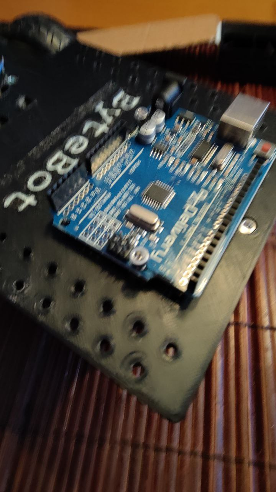

# Innan montering
Observera att all elektronik är känslig mot statiska urladdningar som kan förstöra korten, så om du har något på dig som du vet att du brukar få stötar av så ta gärna av dig det plagget, pläden eller vad som.
Så här ser symbolen ut för den varningen.

# Montera Arduio kortet.
Arduino kortet som finns i lådan monteras med två skruvar från låda 1 till höger på på bilden nedan.

Observera de två brons gängorna som man kan använda för att skruva fast kortet så att det blir så här. (ledsen för att det blev suddigt)

Notera att skruvarna inte behöver dras fast hårt.

Gör samma för motor kontrollen.
