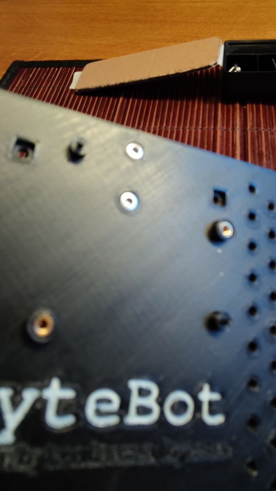
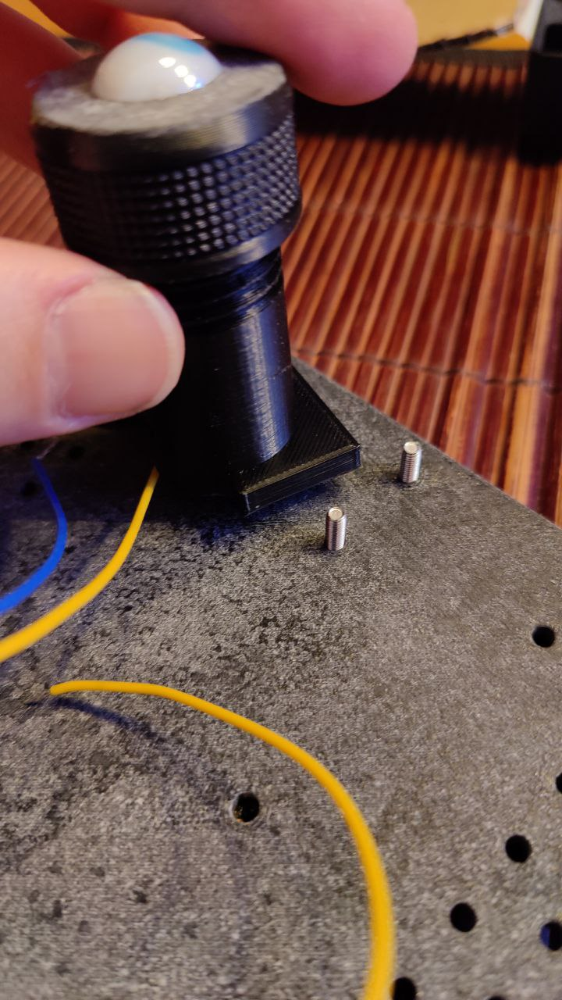
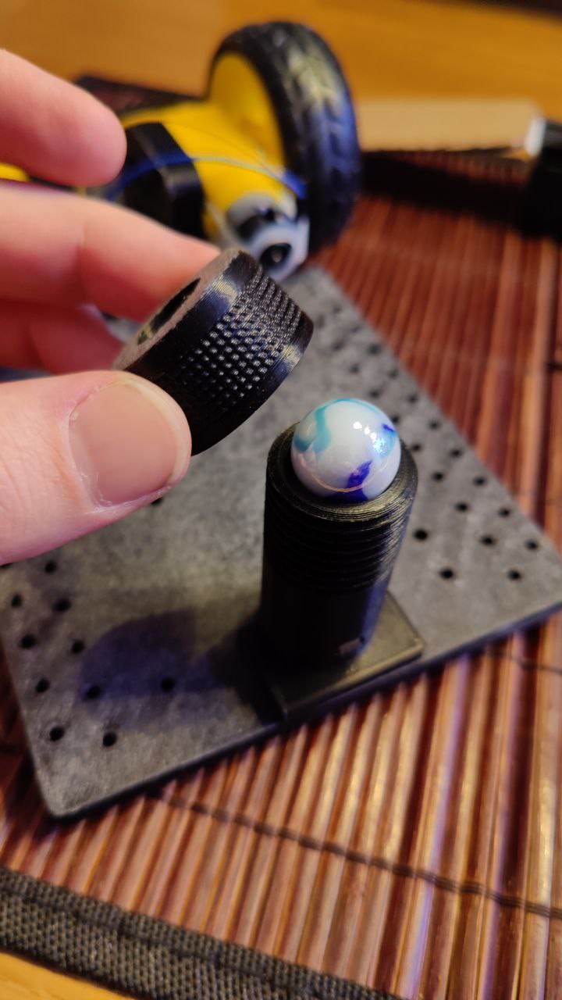
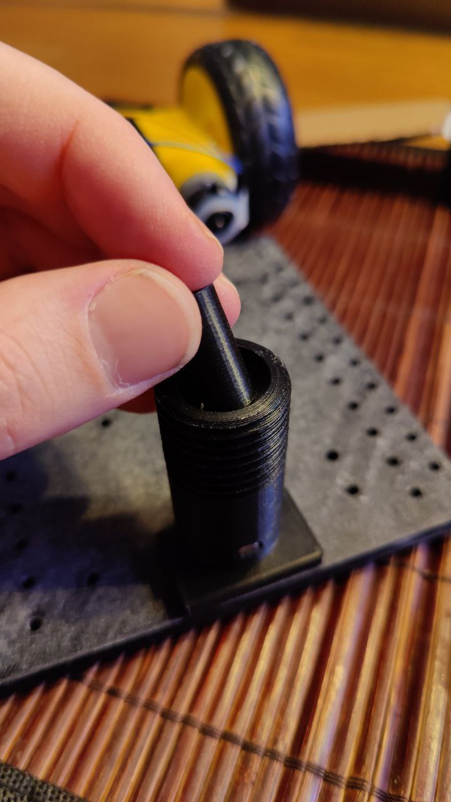
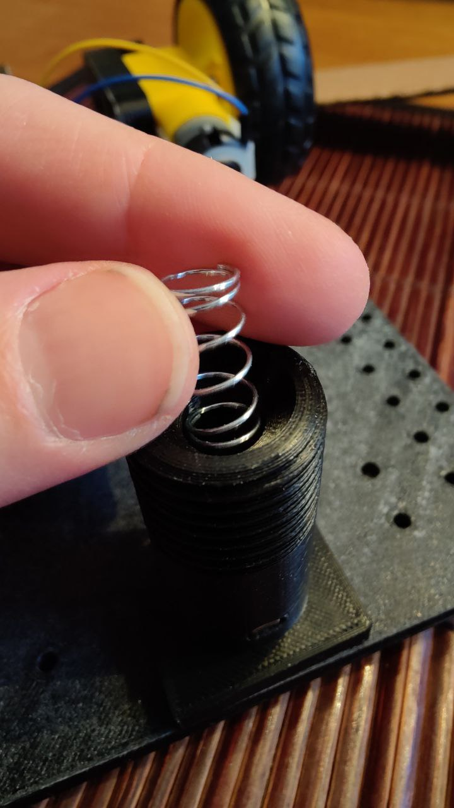
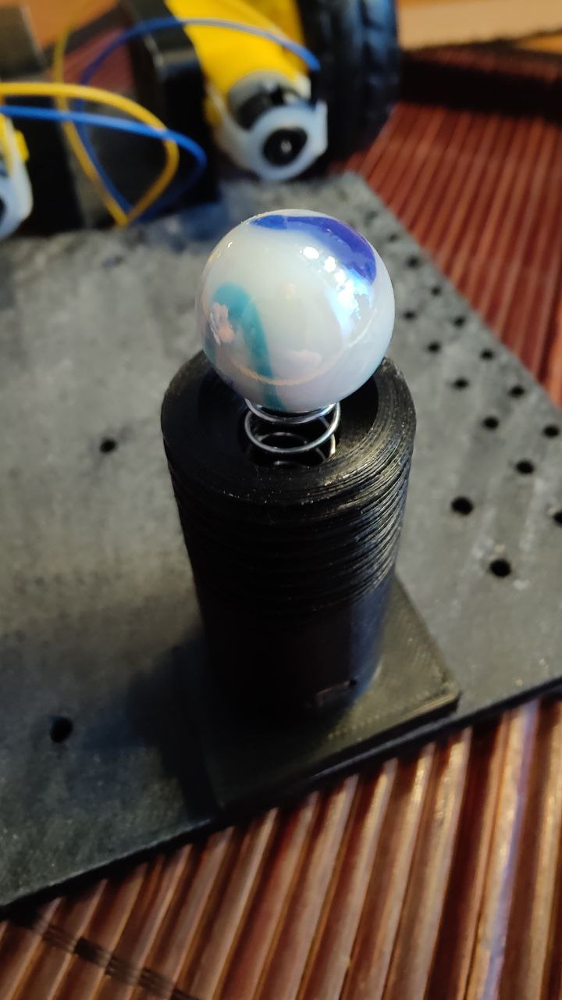

# 3. Montering av bakhjul.

Plocka två skruvar från låda två och skjut in dem i hålen som på bilden nedan.

Från lådan plocka fram saken med en spel kula i och skruva fast den på de skruvar som du satte i bas plattan.

Skruva av den övre delen och plocka ur spel kulan.

Från låda fem plocka fram distans blocket och soppa ner det i hålet.

Sedan stoppar du i fjädern från låda fem.

Sedan sätter du kulan på fjädern.

Skruva på locket igen som du skruvade av tidigare.

[Fortsätt till montering av elektroniken.](./montera_elektroniken.md)
