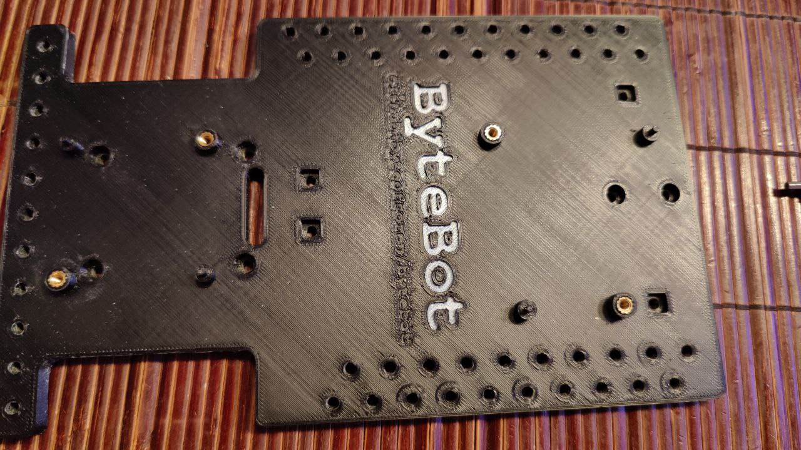
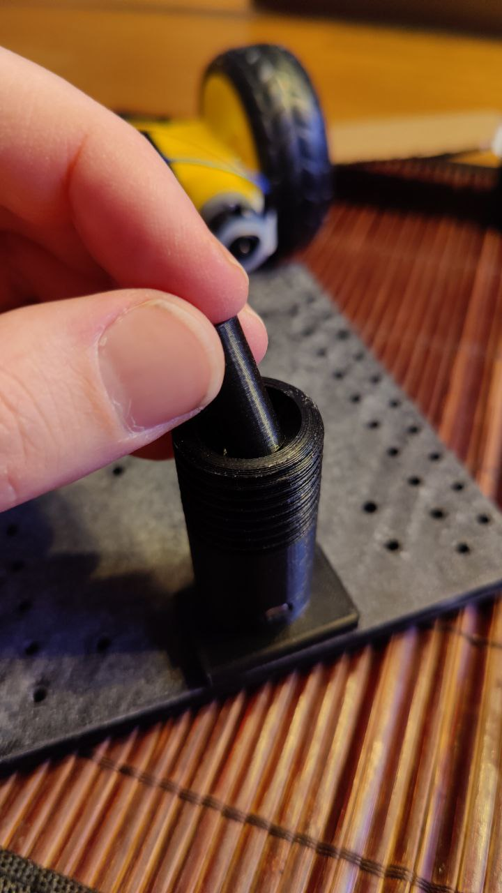
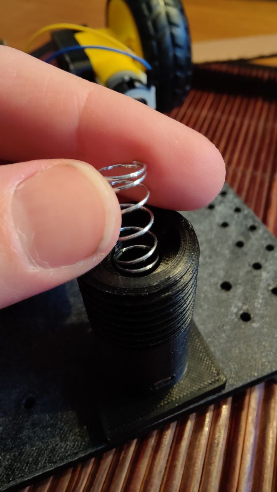

<!-- lang: sv -->
# 1. Montera motorer på fästerna
Ur lådan plocka fram delarna på bilden nedan.


För att montera motorerna mot motor fästena måste motorn vändas åt rätt håll.
Bilden nedan visar hur den lilla runda saken på ena sidan av motorn måste paras mot motor monteringen.


Och om man vänder fel så blir det som på den här bilden.


Sedan plockar du fram två skruvar från låda 3 som du sätter in på sidan av det svarta blocket.


De kan behövas en del kraft för att trycka den helt igenom.
Nu kan du plocka fram två stycken sex kants muttrarna från låda 4 och skruva fast den på bultarna som på bilden nedan.


```
Om du sett denna rad förut{
    Gå till baka till 1 och gör den andra motorn.
}
```

Nu borde du ha något som ser ut så här.


# 2. Montera ett motor fäste på bas kortet.
Nu är det dags att montera motorerna på det stora bas kortet som du plockar fram ur lådan.



Plocka fram 2 skruvar från låda 3 och stoppa dem i hålen så här.


Nu kan det se ut ungefär så här (beroende på vilken sida du skruvar fast) när du har skruvat fast den.


```
Om du sett denna rad förut{
    Gå till baka till 2 och gör den andra motorn.
}
```

# 3. Montering av bakhjul.

Plocka två skruvar från låda två och skjut in dem i hålen som på bilden nedan.


Från lådan plocka fram saken med en spel kula i och skruva fast den på de skruvar som du satte i bas plattan.


Skruva av den övre delen och plocka ur spel kulan.
Från låda fem plocka fram distans blocket och soppa ner det i hålet.



Sedan stoppar du i fjädern från låda fem.




Försök försiktigt att skicka igenom kablarna till motorn igenom hålet.


Så att de kommer ut genom andra sidan.


Nu kan du sätta dit däcken som finns i den stora lådan.

[Fortsätt till montering av elektroniken.](./montera_elektroniken.md)


